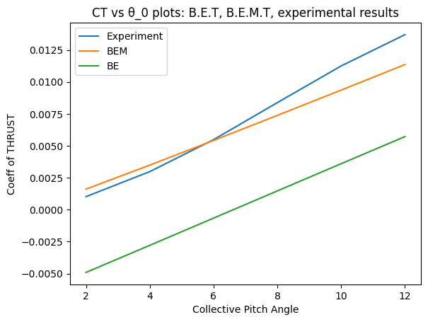
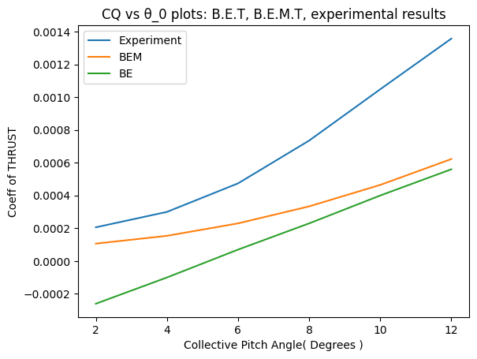
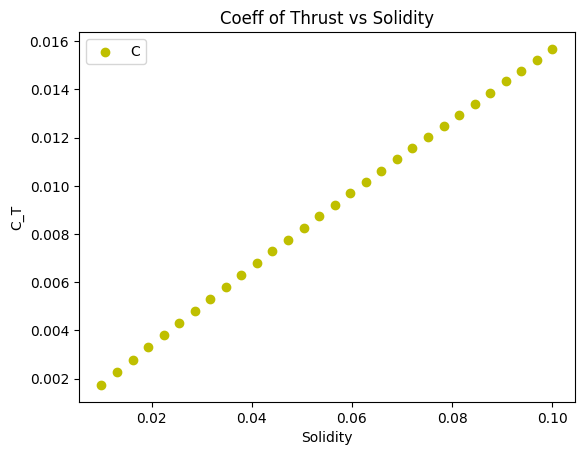
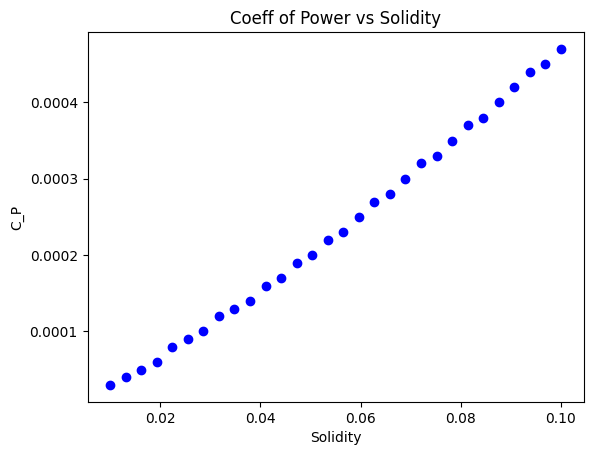
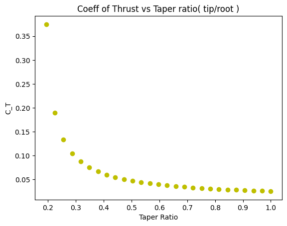
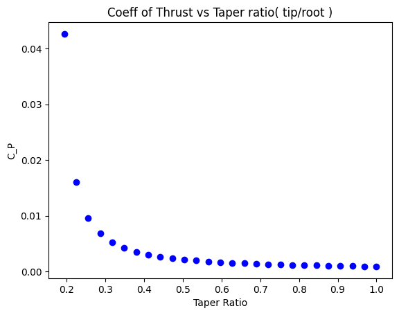
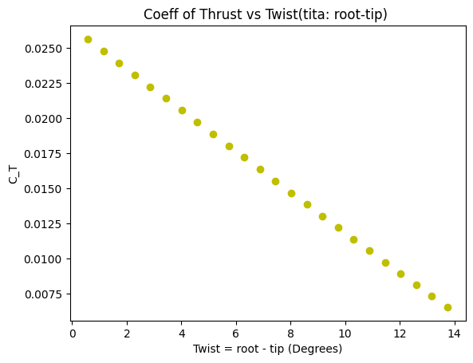
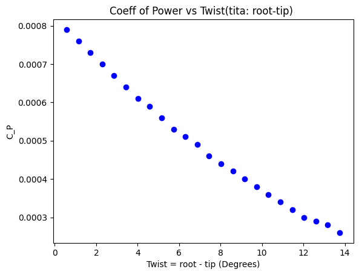

# Assignment 1 -> Amphibous Rotor Design

Welcome to the rotor design report! This document contains step by step process taken towards applying basic theories like Blade Element, Momentum Theory to design a rotor for which a drone can move in air and water.

## Contents

1. [Starting Assumptions & Data](#assumptions)
2. [Initial Sizing](#initial-sizing)
    - [Rotor Diameter](#rotor-diameter)
    - [Ideal Power](#ideal-power)
3. [My Code Folder Structure](#file-structure)
4. [Computational Tool](#code-structure)
5. [Benchmarking the Tools](#benchmarking-the-tools)
6. [Design Variable Variations](#design-variable-variations)
7. [Rotor Design & Performance](#rotor-design--performance)

## Assumptions
- The flight is vertical in air and water, but I haven't thought about the implications of forward flight yet.
- Most of the design is done to cater the Hover scenario, but for climb the values can be obtained using the tools built.
- It is assumed that Cd_water is approx 10 times that of Cd_air for an airfoil.
- Compressibility of the flow is not accounted for.
## Initial Sizing
- The payload mass was given to be 5 kg. I took the total mass to be 15 kg.
- Also Total Volume to be 0.008 (3 times the volume of the payload.)
### Rotor Diameter
It was taken to be 1.7 m . Roughly estimated by looking through drone blades here: [Link](https://uav-en.tmotor.com/html/UAV/Multirotor/Propellers/NS/)
### Ideal Power 
- Air       

    $T = totalMass * g $

    In Hover : 
                $v = \sqrt{\frac{T}{2\rho_a A}}$
                
    $Power = T * v$ ~ 755 W
- Water
    
    $T = totalMass * g - \rho_w * Vol* g$

    In Hover : $v = \sqrt{\frac{T}{2\rho_w A}}$
                
     $Power = T * v$  ~ 8.5 W
## File Structure
- Rotor Blade Design
  - A1.ipynb
  - Validation.ipynb
  - readme.md
  - blades
    - blade1.py
    - blade2.py
    - blade3.py
  - tools
    - __init__.py
    - airfoil.py
    - BET.py
    - BEM.py
  - Images

## Code Structure
### Working/Algorithm/Logic Flow Diagram of the Tools
- **Initialization :**
    The class files in tools folder is initialized with parameters, including the number of blades, angular velocity, rotor radius, lift slope, drag , linear twist, climb velocity, root cutouts, linear taper, and medium (air or water).
- **Thrust Power Coefficients :**
    Thrust, Power equations are written from the respective theories, taken directly from the slides of our Course.
- **Prandtl Tip Loss :**
    In case of BEM theory Lamda is not constant, depends on r and F(tip loss factor) . Where F in turn depends on r again. So there is a function to keep calculating F, Lamda until they converge.
- Tools written for both the theories have lot of paramters that can be varied as written in the Initialization point.

## Benchmarking the Tools
### Expermental Results are taken from [Link](https://ntrs.nasa.gov/api/citations/19930081433/downloads/19930081433.pdf), Where Sigma = 0.0636 ; b = 3
- CT vs θ_0 plots: B.E.T, B.E.M.T, experimental results 

- CQ vs θ_0 plots: B.E.T, B.E.M.T, experimental results

## Design Variable Variations
- Coefficients of Thrust and Power vs Solidity

|  |  |

- Coefficients of Thrust and Power vs Taper ratio

|  |  |

- Coefficients of Thrust and Power vs Twist

|  |  |

## Rotor Design & Performance
|**Design Parameter**   | Design 1       | Design 2       | Design 3       |
|-----------------------|----------------|----------------|----------------|
| Airfoil               | NACA 2412      | NACA 2412      | NACA 0024      |
| Rotor Radius          | 0.85           | 1.18           | 1              |
| No of Blades          | 3              | 2              | 3              |
| Chord Length Variation| 0.12 - 0.02*r  | 0.1 - 0.03*r   | 0.15 - 0.02*r  |
| Root Cutout           | 0.15           | 0.2            | 0.2            |
| _**Operating Condition**_|              |                |                |
| Rotor Speed in Air (rpm)| 750          | 700            | 650            |
| Rotor Speed in Water (rpm)| 25         | 28             | 25             |
| Collective pitch in Air (degrees)| 7   | 6              | 6              |
| Collective pitch in Water (degrees)| 8 | 4              | 5              |
| _**Steady Hover Performance Estimates**_|          |                |                |
| Thrust in Air         | 150.578        | 150.803        | 167.423        |
| Power in Air          | 350.101        | 372.901        | 428.948        |
| Ideal Power in Air    | 755.786        | 544.422        | 642.418        |
| Thrust in Water       | 75.725         | 69.137         | 69.1585        |
| Ideal Power in Water  | 8.433          | 6.075          | 7.168          |
| Power in Water        | 85.565         | 181.474        | 143.183        |
| _**Performance Limits (RPM constant, varying collective pitch only)**_|   | | |
| Stall Collective Pitch Angle in Air| 14   | 13           | 12             |
| Maximum Thrust Before Stall in Air| 320.066| 341.459     | 358.236        |
| Power at Max Thrust in Air| 695.164 | 665.880        | 804.954        |
| Stall Collective Pitch Angle in Water| 20 | 16           | 17             |
| Maximum Thrust Before Stall in Water| 267.908| 406.959   | 389.654        |
| Power at Max Thrust in Water| 144.405| 267.0623      | 240.1076       |

## Acknowledgement
- I wanna thank Taha my classmate, we had a lot of the discussion to understand why things are varying in a certain way.
- Thanks to Prof Dwanil Shukla , He helped me with doubts I had in the way to approach this Assignment

## Reference
- [ Knight, M., & Hefner, R. A. (1937). Static thrust analysis of the lifting airscrew. ](https://ntrs.nasa.gov/api/citations/19930081433/downloads/19930081433.pdf)
- [Airfoil Data](http://airfoiltools.com/airfoil/details?airfoil=naca2412-il)
- [Example Rotors used in current Drones](https://uav-en.tmotor.com/html/UAV/Multirotor/Propellers/NS/)
## License

This project is licensed under the [MIT License](LICENSE).
