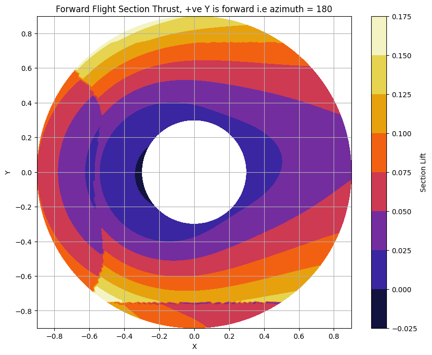
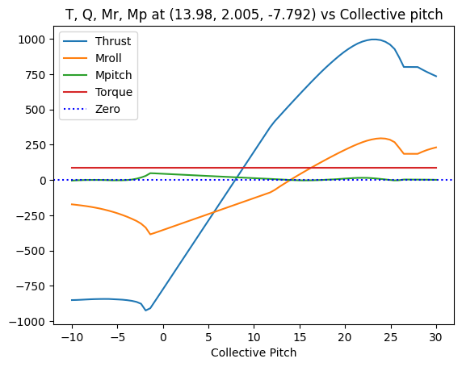
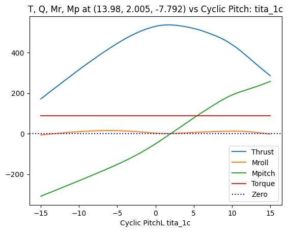
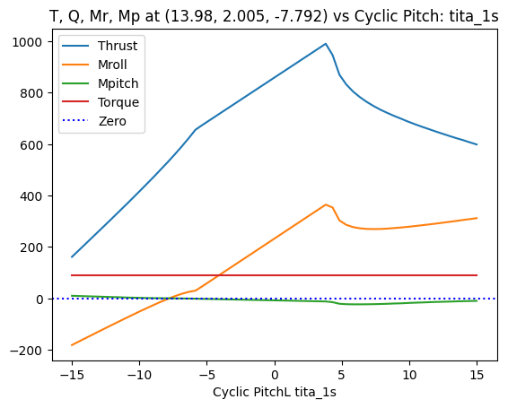

# Assignment 1 -> Amphibous Rotor Design

Welcome to the rotor design! This document contains step by step process taken towards applying basic design theories like Blade Element, Momentum Theory.
Later applying them for Forward Flight. Cyclic Pitch inputs, making the Moments zero. 
Designing a Tail Rotor to counter the Torque produced by the hub on the body.
3. [My Code Folder Structure](#file-structure)
4. [Computational Tool](#code-structure)
5. [Benchmarking the Tools](#benchmarking-the-tools)
6. [Design Variable Variations](#design-variable-variations)
7. [Rotor Design & Performance](#rotor-design--performance)

## File Structure
- Rotor Blade Design
  - tinkering.ipynb
  - tailRotor.ipynb
  - Validation.ipynb
  - readme.md
  - blades
    - blade1.py
    - blade2.py
    - blade3.py
  - tools
    - \__init__\.py
    - airfoil.py
    - BET.py
    - BEM.py
    - Forward.py
  - Images

## Code Structure
Code is Modular.
In the tools section each file has classes written for forward flight, rotor blade, BEM theory etc..

tinkering.ipynb was a playground where all the classes from the tools are improted, and the design specs are changed based on Moment, Thrust, Torque plots.

tailRotor.ipynb where the iteration was done to reach a dail design.
## Trim Conditions
|**Operation Conditions**   | Forward Flight | Veritcal Climb | 
|-----------------------|-----------|----------|
|$\theta$ 0 |14|14|
|$\theta$ 1s |2|-0.01|
|$\theta$ 1c |2|0|
|twist slope |-0.05|-0.05|
|$\alpha$ TPP |3.5|0|
|$\beta$ 0|1.8|1|
|Net Vertical Force|530 N|380 N|
|Net Longitudinal Force|35 N| 0|
|Pitch Moment|0.416|0.412|
|Roll Moment|0.532|0|

## Tail Rotor Design
|**Design Parameter**   | Quantity  | 
|-----------------------|-----------|
| Airfoil | NACA 2412|
|Rotor Radius| 0.3 m|
|Rotor Speed| 2000 rpm|
|No of blades|4|
|Chord Length|0.08 m|
|Root cutout|0.05m|
## Rotor Design & Performance
|**Design Parameter**   | Design 1       | Design 2       | Design 3       |
|-----------------------|----------------|----------------|----------------|
| Airfoil               | NACA 2412      | NACA 2412      | NACA 0024      |
| Rotor Radius          | 0.85           | 1.18           | 1              |
| No of Blades          | 3              | 2              | 3              |
| Chord Length Variation| 0.12 - 0.02*r  | 0.1 - 0.03*r   | 0.15 - 0.02*r  |
| Root Cutout           | 0.15           | 0.2            | 0.2            |
| _**Operating Condition**_|              |                |                |
| Rotor Speed in Air (rpm)| 750          | 700            | 650            |
| Rotor Speed in Water (rpm)| 25         | 28             | 25             |
| Collective pitch in Air (degrees)| 7   | 6              | 6              |
| Collective pitch in Water (degrees)| 8 | 4              | 5              |
| _**Steady Hover Performance Estimates**_|          |                |                |
| Thrust in Air         | 150.578        | 150.803        | 167.423        |
| Power in Air          | 350.101        | 372.901        | 428.948        |
| Ideal Power in Air    | 755.786        | 544.422        | 642.418        |
| Thrust in Water       | 75.725         | 69.137         | 69.1585        |
| Ideal Power in Water  | 8.433          | 6.075          | 7.168          |
| Power in Water        | 85.565         | 181.474        | 143.183        |
| _**Performance Limits (RPM constant, varying collective pitch only)**_|   | | |
| Stall Collective Pitch Angle in Air| 14   | 13           | 12             |
| Maximum Thrust Before Stall in Air| 320.066| 341.459     | 358.236        |
| Power at Max Thrust in Air| 695.164 | 665.880        | 804.954        |
| Stall Collective Pitch Angle in Water| 20 | 16           | 17             |
| Maximum Thrust Before Stall in Water| 267.908| 406.959   | 389.654        |
| Power at Max Thrust in Water| 144.405| 267.0623      | 240.1076       |

## Some Plots.
Contour Plots. If you see the image is symmetrical => Moments are near zero.

Plots of Thrust, Torwque, Pitch Moment, Roll Moment vs $\theta$ 0, $\theta$ 1c, $\theta$ 1s

## Acknowledgement
- To Taha my classmate, we had a lot of the discussion to understand why things are varying in a certain way.
- To Prof Dwanil Shukla , He helped me with doubts I had in the way to approach this Assignment

## Reference
- [ Knight, M., & Hefner, R. A. (1937). Static thrust analysis of the lifting airscrew. ](https://ntrs.nasa.gov/api/citations/19930081433/downloads/19930081433.pdf)
- [Airfoil Data](http://airfoiltools.com/airfoil/details?airfoil=naca2412-il)
- [Example Rotors used in current Drones](https://uav-en.tmotor.com/html/UAV/Multirotor/Propellers/NS/)
## License

This project is licensed under the [MIT License](LICENSE).
